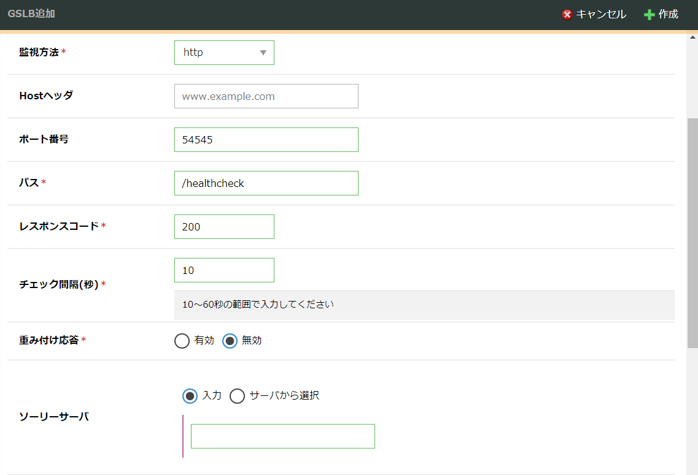
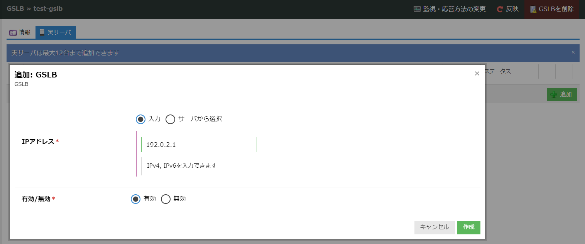
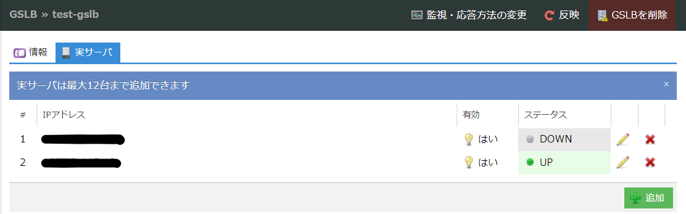

# SAKURA Distributed MariaDB Controller(Sakura-DBC) クイックスタートガイド

## 概要

SAKURA Distributed MariaDB Controller(以降Sakura-DBCと表記)を最小限動作させるためのセットアップ手順を記載します。

## 動作に必要なリソース

Sakura-DBCを最小限動作させるために、以下のリソースが必要です。

| 必要なリソース     | 推奨スペック                                                                        | 必要数 |
| ------------------ | ----------------------------------------------------------------------------------- | ------ |
| データベースサーバ | CPU : 4コア以上 <br> Memory : 4GB以上 <br> ストレージ : 20GB以上                    | 2      |
| アンカーサーバ     | CPU : 1コア以上 <br> Memory : 2GB以上 <br> ストレージ : 20GB以上                    | 1      |
| GSLB               | [さくらのクラウドGSLB](https://manual.sakura.ad.jp/cloud/appliance/gslb/index.html) | 1      |

サーバについて

- Linuxディストリビューションは `RHEL8系` を想定した手順を記載しており、動作確認は `Rocky Linux 8.8` にて実施しています
- 3台のサーバに独立したグローバルIPアドレスが必要です
- 3台のサーバは異なるAZ(Availability Zone)に配置してください
- データベースサーバは、一方がPrimary、もう一方がReplicaとして稼働するように制御されます
- アンカーサーバは、ネットワーク分断を検知するためのBGP経路を広告する役割を担います

GSLBについて

- GSLBにより、Primary状態であるDBサーバのIPアドレスをDNSレスポンスすることで、アクセス先を切り替えます
- GSLBとして、AWS Route53なども利用可能かと思われますが、動作未確認です
 
## 利用するコンポーネント

Sakura-DBCは、以下のコンポーネントを利用します。

| 利用するコンポーネント                     | 動作確認バージョン    |
| --------------------------------------- | ------------------ |
| [go](https://go.dev/)                   | 1.24.1             |
| [gobgp](https://github.com/osrg/gobgp)  | 3.36.0             |
| [MariaDB](https://mariadb.org/)         | 10.11.4            |
| [FRRouting](https://frrouting.org/)     | 8.5.2              |
| nftables                                | 1.0.4              |

注: nftablesは、Primaryとなるデータベースサーバのみが3306番ポートへの接続を受け付けるようにパケットフィルタルールを設定するために使用されます

## セットアップ手順

### 1. nftablesの設定

対象サーバ: アンカーサーバ、データベースサーバ2台

- firewalldを停止し、nftableを有効化します
  ```
  # systemctl stop firewalld
  # systemctl disable firewalld
  
  # nft add table ip filter
  # nft list ruleset > /etc/sysconfig/nftables.conf
  # systemctl enable nftables
  ```

### 2. FRRoutingのセットアップ

対象サーバ: アンカーサーバのみ(DBサーバでは不要)

- FRRをインストールします
  ```
  # yum -y install https://rpm.frrouting.org/repo/frr-8-repo-1-0.el8.noarch.rpm
  # yum -y install frr
  ```
- /etc/frr/daemons ファイルを作成します
  ```
  bgpd=yes
  vtysh_enable=yes
  zebra_options="  -A 127.0.0.1 -s 90000000"
  bgpd_options="   -A 127.0.0.1 -n"
  staticd_options="-A 127.0.0.1"
  ```
- /etc/frr/frr.conf ファイルを作成します
  ```
  hostname test-server 【自身のホスト名を記入】
  log stdout
  log syslog informational
  no ip forwarding
  no ipv6 forwarding
  bgp no-rib
  !
  router bgp 65003
   bgp router-id xx.xx.xx.xx 【自身のIPアドレスを記入】
   bgp log-neighbor-changes
   no bgp ebgp-requires-policy
   bgp disable-ebgp-connected-route-check
   no bgp network import-check
   neighbor yy.yy.yy.yy remote-as 65001 【DBサーバ(1台目)のIPアドレスを記入】
   neighbor yy.yy.yy.yy timers 3 9
   neighbor zz.zz.zz.zz remote-as 65002 【DBサーバ(2台目)のIPアドレスを記入】
   neighbor zz.zz.zz.zz timers 3 9
   !
   address-family ipv4 unicast
    network xx.xx.xx.xx/32 route-map anchor 【自身のIPアドレスを記入】
    neighbor yy.yy.yy.yy soft-reconfiguration inbound 【DBサーバ(1台目)のIPアドレスを記入】
    neighbor zz.zz.zz.zz soft-reconfiguration inbound 【DBサーバ(2台目)のIPアドレスを記入】
   exit-address-family
  exit
  !
  bgp community-list standard anchor seq 5 permit 65000:10
  bgp community-list standard candidate seq 5 permit 65000:2
  bgp community-list standard fault seq 5 permit 65000:1
  bgp community-list standard primary seq 5 permit 65000:3
  bgp community-list standard replica seq 5 permit 65000:4
  !
  route-map fault permit 10
   set community 65000:1
  exit
  !
  route-map candidate permit 10
   set community 65000:2
  exit
  !
  route-map primary permit 10
   set community 65000:3
  exit
  !
  route-map replica permit 10
   set community 65000:4
  exit
  !
  route-map anchor permit 10
   set community 65000:10
  exit
  !
  ip nht resolve-via-default
  ```
- FRRを起動します
  ```
  # systemctl enable frr
  # systemctl start frr
  ```
- (DBサーバセットアップ後) BGPピアが上がり、経路情報が交換できていることを確認します
  ```
  # vtysh
  show ip bgp sum
  show ip bgp
  ```

### 3. MariaDBのセットアップ

対象サーバ: データベースサーバ2台

- /etc/yum.repos.d/MariaDB.repo ファイルを作成します
  ```
  [mariadb]
  name = MariaDB
  baseurl = https://rpm.mariadb.org/10.11/rhel/$releasever/$basearch
  module_hotfixes = 1
  gpgkey = https://rpm.mariadb.org/RPM-GPG-KEY-MariaDB
  gpgcheck = 1
  ```
- MariaDBをインストールします
  ```
  # yum -y install MariaDB-client MariaDB-common MariaDB-compat MariaDB-server MariaDB-shared
  ```
- /etc/my.cnf ファイルを作成します
  ```
  [mariadb]
  
  character_set_server = utf8mb4
  skip_name_resolve = 1
  read_only = 1
  enforce_storage_engine = InnoDB
  
  innodb_buffer_pool_size = 3G 【搭載メモリに応じて割り当てるサイズを指定】
  innodb_flush_method = O_DIRECT
  
  server_id = XX 【1号機は1、2号機は2を指定するなど、ユニークになるように割り当てる】
  log_bin = log-bin
  binlog_expire_logs_seconds = 86400
  gtid_strict_mode = 1
  
  relay_log = relay-bin
  log_slave_updates = 1
  
  rpl_semi_sync_master_enabled = 1
  rpl_semi_sync_slave_enabled = 1
  rpl_semi_sync_master_wait_point = AFTER_SYNC
  rpl_semi_sync_master_wait_no_slave = 0
  rpl_semi_sync_master_timeout = 30000
  ```
- 1号機でレプリケーション用ユーザのパスワードを生成します
  ```
  # openssl rand 1000 | tr -dc '0-9A-Za-z' | fold -w 31 | head -1 > /root/.db-replica-password
  ```
- 生成したファイルを2号機にコピーします
  ```
  # scp /root/.db-replica-password root@xx.xx.xx.xx:
  ```
- 1号機にてDBの初期設定をします
  ```
  # systemctl start mariadb
  
  # mysql -e "drop database if exists test"
  # mysql -e "delete from mysql.global_priv where User=''"
  # mysql -e "delete from mysql.global_priv where User='PUBLIC'"
  # mysql -e "delete from mysql.db where Db='test' or Db='test\\_%'"
  # mysql -e "delete from mysql.proxies_priv"
  
  # mysql -e "flush privileges"
  
  # REPL_PW=$(cat ~/.db-replica-password)
  # mysql -e "grant all on *.* to repl identified by '$REPL_PW'"
  ```
- 2号機にて、レプリケーション設定をします
  ```
  # systemctl start mariadb
  
  # mysql -e "drop database if exists test"
  
  # REMOTE_HOST=xx.xx.xx.xx 【1号機のIPアドレスを記入】
  # PASSWORD=$(cat /root/.db-replica-password)
  
  # mysqldump --all-databases --master-data=1 --gtid --single-transaction -h $REMOTE_HOST -p$PASSWORD -u repl | mysql
  
  # mysql -e 'flush privileges'
  
  # mysql -e "change master to master_host = '$REMOTE_HOST', master_user = 'repl', master_password = '$PASSWORD', master_use_gtid = slave_pos"
  
  # mysql -e 'reset master'
  # mysql -e 'set global gtid_slave_pos=@@gtid_slave_pos'
  
  # mysql -e 'start replica'
  
  ! レプリケーションが確立したか確認
  # mysql -e 'show replica status\G'
  ```

### 4. Sakura-DBCのセットアップ

対象サーバ: データベースサーバ2台

- golangをインストールします
  ```
  # wget https://go.dev/dl/go1.24.1.linux-amd64.tar.gz
  # tar -C /usr/local -xzf go1.24.1.linux-amd64.tar.gz
  # export PATH="$PATH:/usr/local/go/bin"
  ```
- Sakura-DBCレポジトリをクローンし、コンパイルします
  ```
  # cd /root
  # git clone https://github.com/sakura-internet/distributed-mariadb-controller.git
  # cd distributed-mariadb-controller
  # make all
  ```
  注: コンパイルが成功すると、実行バイナリが `/root/distributed-mariadb-controller/bin/db-controller` に生成されます
- /etc/systemd/system/db-controller.service ファイルを作成します
  ```
  [Unit]
  Description=Database Controller
  After=network-online.target
  
  [Service]
  Type=simple
  ExecStart=/root/distributed-mariadb-controller/bin/db-controller --log-level info --db-replica-password-filepath /root/.db-replica-password --db-replica-source-port 13306 --bgp-local-asn XXXX --bgp-peer1-addr xx.xx.xx.xx --bgp-peer1-asn XXXX --bgp-peer2-addr xx.xx.xx.xx --bgp-peer2-asn XXXX 【アンカーともう一台のDBサーバのIPアドレスとAS番号を記入】
  WorkingDirectory = /root/distributed-mariadb-controller
  
  [Install]
  WantedBy=multi-user.target
  ```
- systemdに反映させます
  ```
  # systemctl daemon-reload
  ```
- db-controllerを始めに1号機、続いて2号機の順で起動します
  ```
  # systemctl enable db-controller
  # systemctl start db-controller
  ```
- gobgpをインストールします
  (db-controllerの動作上必要になるものではありませんが、CLIによりBGPの状態確認ができるためインストールを推奨します)
  ```
  # wget https://github.com/osrg/gobgp/releases/download/v3.35.0/gobgp_3.36.0_linux_amd64.tar.gz
  # tar -C /usr/local/bin -xzf gobgp_3.36.0_linux_amd64.tar.gz
  ```

### 5. GSLBのセットアップ

ここでは、例としてさくらのクラウドGSLBを利用する場合の手順を示します

注: db-controllerはポート54545にて、以下のHTTPレスポンスを行います。

- Primary状態の場合 => 200 OK
- それ以外の状態の場合 => 503 Service Unavailable

さくらのクラウドGSLBにて、これをヘルスチェック対象とすることで、GSLBがPrimary状態のDBサーバのIPアドレスをDNSレスポンスするようにします。

- コントロールパネルよりGSLBを作成します
  
- 入力フィールドは以下の通りに入力します
  - 監視方法: HTTP
  - Hostヘッダ: (空欄)
  - ポート番号: 54545
  - パス: /healthcheck
  - レスポンスコード: 200
  - チェック間隔(秒): 10
  - 重み付け応答: 無効
  - ソーリーサーバ: (空欄)
- 作成後、実サーバとして2台のデータベースサーバのIPアドレスを登録します
  
- 反映ボタンを押下した後、しばらくしてヘルスチェックが正常に通っていることを確認します
  
  注: Primary側がUP、Replica側がDOWNの表示となります
- GSLBがPrimary側データベースサーバのIPアドレスをDNSレスポンスすることを確認します
  ```
  $ dig +short site-xxxxxxxxxxxx.gslbxx.sakura.ne.jp
  xx.xx.xx.xx
  ```
